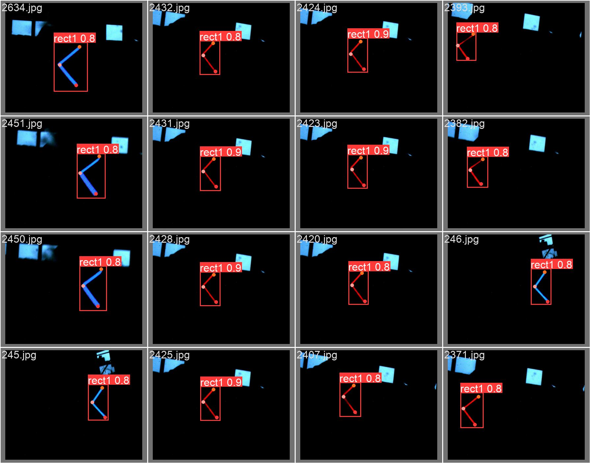

# enginner_vision
工程自动兑换识别工程文件

# 安装openvion
# Running Time
sudo mkdir /opt/intel

cd /tmp

curl -L https://storage.openvinotoolkit.org/repositories/openvino/packages/2023.0/linux/l_openvino_toolkit_ubuntu22_2023.0.0.10926.b4452d56304_x86_64.tgz --output openvino_2023.0.0.tgz

tar -xf openvino_2023.0.0.tgz

sudo mv l_openvino_toolkit_ubuntu22_2023.0.0.10926.b4452d56304_x86_64 /opt/intel/openvino_2023.0.0

cd /opt/intel/openvino_2023.0.0
sudo -E ./install_dependencies/install_openvino_dependencies.sh

cd /opt/intel
sudo ln -s openvino_2023.0.0 openvino_2023

echo 'source /opt/intel/openvino_2023/setupvars.sh' >> ~/.bashrc

# Develop Toolkit

python3 -m pip install --upgrade pip -i https://pypi.tuna.tsinghua.edu.cn/simple
pip install openvino-dev==2023.0.1 -i https://pypi.tuna.tsinghua.edu.cn/simple
